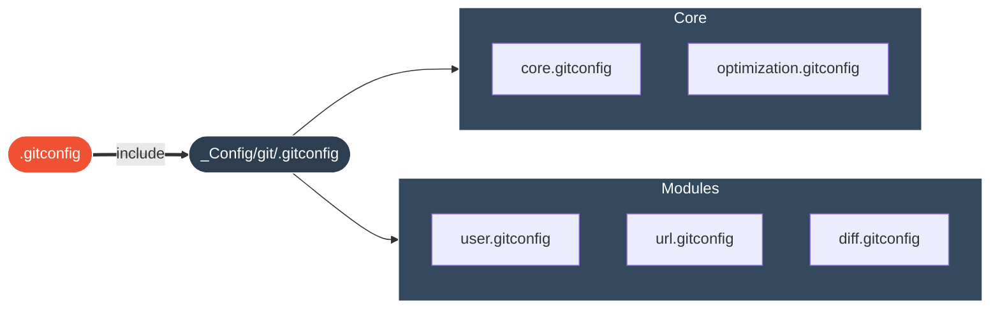

<div align="center">


[](https://git-scm.com/)
[](LICENSE)
[](https://apple.com)

**Une configuration Git modulaire, sécurisée et ultra-rapide pour les développeurs exigeants.**

</div>

<br/>

<div align="center">

| | Section | Description |
|:---:|:---|:---|
| ⚡ | [**Installation**](#-installation) | Prêt en 30 secondes |
| 🏗️ | [**Architecture**](#-architecture) | Structure modulaire |
| ✨ | [**Features**](#-features) | Optimisations activées |
| 🛠️ | [**Règles**](#-règles) | Convention de commit |

</div>

<br/>

## ⚡ Installation

Plus besoin de copier-coller des snippets.

```bash
# 1. Cloner ce dépôt (où vous voulez)
git clone https://github.com/votre-user/git-config.git ~/Developer/_Config/git

# 2. Lancer l'installateur
cd ~/Developer/_Config/git && ./install.sh
```

**L'installateur interactif va :**
1. Vous demander votre **Identité** (Nom, Email, GitHub User).
2. Détecter votre clé SSH pour la **Signature automatique**.
3. Configurer les **chemins absolus** pour les Templates.
4. Lier proprement `~/.gitconfig` via un `include`.

<br/>

## 🏗️ Architecture

Fini le fichier `~/.gitconfig` de 1000 lignes. Tout est rangé.



<br/>

## ✨ Features (État de l'art)

| Feature | Description | Impact |
|:---|:---|:---|
| **Auto-Stash** | `rebase.autostash = true` | Sauvegarde auto avant pull/rebase. Fini les pertes. |
| **Zdiff3** | `merge.conflictstyle = zdiff3` | Affiche la base commune lors des conflits. Indispensable. |
| **Moniteur** | `core.fsmonitor = true` | `git status` instantané même sur les gros monorepos. |
| **Signature** | `commit.gpgsign = true` | Signe tous les commits via SSH (Badge Verified). |
| **Delta** | `core.pager = delta` | Diffs syntaxiques magnifiques (si installé). |
| **SSH Force** | `url.insteadOf` | Force l'usage de SSH pour GitHub (fini HTTPS). |

<br/>

## 🛠️ Règles & Convention

Cette config force l'utilisation d'un **Template de Commit** professionnel (`git commit` sans argument).

### Types Autorisés
*   `feat` : Nouvelle fonctionnalité
*   `fix` : Correction de bug
*   `wip` : Travail en cours
*   `chore` : Maintenance, dépendances
*   `refactor` : Amélioration du code sans changer le comportement
*   `test` : Ajout de tests
*   `docs` : Documentation

> **Note :** L'éditeur par défaut est configuré sur `nano` pour la simplicité, mais respecte votre variable `$EDITOR` si définie.

<br/>

<div align="center">
Made with ❤️ for Git Users
</div>
