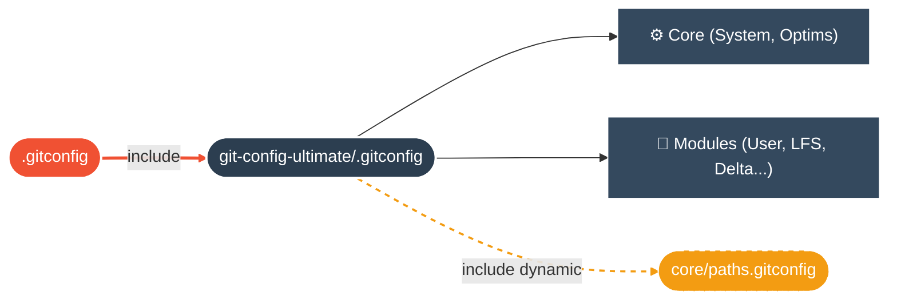

<div align="center">


[](https://git-scm.com/)
[](LICENSE)
[](https://github.com/yanix2445)

**Une configuration Git modulaire, sécurisée et ultra-rapide pour les développeurs exigeants.**

</div>

<br/>

<div align="center">

| | Section | Description |
|:---:|:---|:---|
| ⚡ | [**Installation**](#-installation) | Prêt en 30 secondes |
| 🏗️ | [**Architecture**](#-architecture) | Structure du projet |
| ✨ | [**Features**](#-features) | Optimisations activées |
| 🛠️ | [**Règles**](#-règles) | Convention de commit |
| � | [**Dépannage**](#-dépannage) | Résoudre les problèmes |
| �📜 | [**Licence**](#-licence) | Apache 2.0 |

</div>

<br/>

<br/>

## ⚡ Installation

```bash
git clone https://github.com/yanix2445/git-config-ultimate.git ~/git-config-ultimate
cd ~/git-config-ultimate && ./install.sh
```

> **Setup Automatisé :**
> *   ✅ **Identité** & Email
> *   ✅ **Signature SSH** (GPG)
> *   ✅ **Chemins** Portables
> *   ✅ **Clean Include**

<br/>

## 🏗️ Architecture

<div align="center">



</div>

<br/>

<div align="center">

| Fichier | Type | Rôle |
|:--------|:-----:|:-----|
| `.gitconfig` | ⛔ | Point d'entrée — **ne pas modifier** |
| `core/` | ⚙️ | Optimisations bas niveau & système |
| `modules/` | 🧩 | Fonctionnalités (User, LFS, Delta...) |
| `paths.gitconfig` | 🔥 | **Généré localement** — ignoré par Git |

</div>

<br/>

<br/>

## ✨ Features

<div align="center">

<table>
<tr>
<td width="50%" valign="top">

### 🚀 Performance & Sécurité

| Feature | Impact |
|:---|:---|
| **FS Monitor** | `git status` instantané |
| **Commit Graph** | Logs et Merges ultra-rapides |
| **SSH Signing** | Commits signés (Verified) |
| **SSH Force** | Fini HTTPS, vive SSH |

</td>
<td width="50%" valign="top">

### 🎨 Confort & Visuel

| Feature | Impact |
|:---|:---|
| **Zdiff3** | Résolution de conflits intelligente |
| **Delta** | Diffs syntaxiques magnifiques |
| **Auto-Stash** | Pull/Rebase sans perte |
| **Sort** | Branches triées par date |

</td>
</tr>
</table>

</div>

<br/>

### 📝 Exemple

```text
feat(core): Ajout du module user

- Ajout de user.gitconfig
- Configuration de la clé SSH
```

> **Template** : `git commit` ouvre un modèle pré-rempli.

</td>
</tr>
</table>

</div>

<br/>

## 🚨 Dépannage

<div align="center">

<table>
<tr>
<td width="60%" valign="top">

### ❓ Problèmes Courants

| Symptôme | Solution Rapide |
|:---|:---|
| **Signature Failed** | Vérifier clé SSH dans GitHub |
| **Delta not found** | Installer : `brew install git-delta` |
| **Slow Status** | `git maintenance start` |
| **Permission Denied** | Vérifier vos clés SSH |

</td>
<td width="5%"></td>
<td width="35%" valign="top">

### ⚡ Actions

**Un souci de chemin ?**
Relancer l'installateur pour régénérer les chemins locaux.

<br>

```bash
# Régénération
./install.sh
```

<br>

> <span style="color:#f05133">⚠️ <b>Note :</b></span> Cela ne touche pas à vos données, juste à la config.

</td>
</tr>
</table>

</div>

<br>

<br>

<div align="center">

<a href="https://github.com/yanix2445">

</a>

</div>
