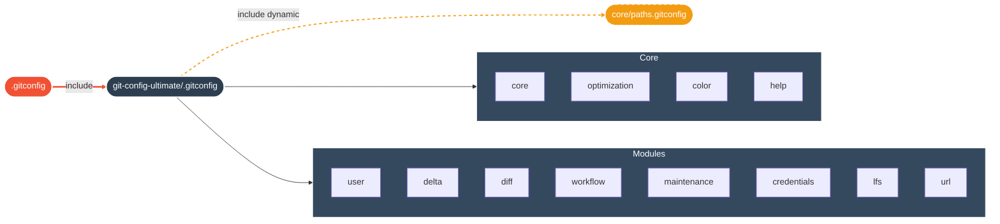

<div align="center">


[](https://git-scm.com/)
[](LICENSE)
[](https://github.com/yanix2445)

**Une configuration Git modulaire, sécurisée et ultra-rapide pour les développeurs exigeants.**

</div>

<br/>

<div align="center">

| | Section | Description |
|:---:|:---|:---|
| ⚡ | [**Installation**](#-installation) | Prêt en 30 secondes |
| 🏗️ | [**Architecture**](#-architecture) | Structure modulaire |
| ✨ | [**Features**](#-features) | Optimisations activées |
| 🛠️ | [**Règles**](#-règles) | Convention de commit |
| 📜 | [**Licence**](#-licence) | Apache 2.0 |

</div>

<br/>

<br/>

## ⚡ Installation

```bash
# 1. Cloner
git clone https://github.com/yanix2445/git-config-ultimate.git ~/git-config-ultimate

# 2. Installer
cd ~/git-config-ultimate && ./install.sh
```

> **L'installateur interactif va :**
> - ✅ Configurer votre **Identité** (User, Email)
> - ✅ Activer la **Signature SSH** (Badge Verified)
> - ✅ Générer les **Chemins Locaux** (Paths)
> - ✅ Lier le tout proprement (`include`)

<br/>

## 🏗️ Architecture

<div align="center">



</div>

<br/>

## ✨ Features

<div align="center">

<table>
<tr>
<td width="50%" valign="top">

### 🚀 Performance & Sécurité

| Feature | Impact |
|:---|:---|
| **FS Monitor** | `git status` instantané |
| **Commit Graph** | Logs et Merges ultra-rapides |
| **SSH Signing** | Commits signés (Verified) |
| **SSH Force** | Fini HTTPS, vive SSH |

</td>
<td width="50%" valign="top">

### 🎨 Confort & Visuel

| Feature | Impact |
|:---|:---|
| **Zdiff3** | Résolution de conflits intelligente |
| **Delta** | Diffs syntaxiques magnifiques |
| **Auto-Stash** | Pull/Rebase sans perte |
| **Sort** | Branches triées par date |

</td>
</tr>
</table>

</div>

<br/>

## 🛠️ Règles

<div align="center">
<i>Cette config impose un standard professionnel pour vos commits.</i>

<br/>

| Type | Usage | Exemple |
|:---:|:---|:---|
| `feat` | Nouvelle fonctionnalité | `feat(core): Ajout du module user` |
| `fix` | Correction de bug | `fix(install): Correction des chemins` |
| `docs` | Documentation | `docs(readme): Nouveau design` |
| `chore` | Maintenance | `chore: Mise à jour des deps` |
| `refactor` | Amélioration code | `refactor: Nettoyage install.sh` |

</div>

<br/>

<br/>

<div align="center">

<a href="https://github.com/yanix2445">

</a>

</div>
